# BossMatchJobHunter
Boss直聘批量立即沟通，提高找工作效率。

## 描述 
Boss直聘批量投递脚本，Boss没有批量沟通功能，而且Boss回复率太低 ，为了提高找工作效率而制作，将就能用，你也可按照自己的需求以爆改本脚本  
~~所以这是自用的，我不会展示图片的，只用文字的描述，这样懂我的人自然会懂，不懂的就自然会放弃~~  
    
<a href="https://star-history.com/#20241204/BossMatchJobHunter&Date">
  <picture>
    <source media="(prefers-color-scheme: dark)" srcset="https://api.star-history.com/svg?repos=20241204/BossMatchJobHunter&type=Date&theme=dark" />
    <source media="(prefers-color-scheme: light)" srcset="https://api.star-history.com/svg?repos=20241204/BossMatchJobHunter&type=Date" />
    
  </picture>
</a>

## 依赖
  Python 程序  
  Edge 浏览器  
  Edge webdriver：https://developer.microsoft.com/en-us/microsoft-edge/tools/webdriver/  

## 实现思路
### 首次执行脚本，判断 cookie 文件是否存在  
  不存在 cookie 文件，则先访问登录页面，给用户70秒时间让他们登陆，等时间一到，获取当前页面 cookie 并存储到当前路径中  
  然后继续给用户 300 秒的时间，通过浏览器安装插件提取浏览器可以使用的cookie  
### 再次执行脚本，判断 cookie 文件是否存在  
  存在 cookie 文件，则访问预先配置好的搜索链接 search_url 访问，并获取元素节点执行点击操作  

## 使用说明
> 这个脚本需要本地环境中有 webdriver 驱动来启动本地浏览器以及python环境实现自动化，我觉得很复杂，我尝试描述一下怎么使用吧？ 
### 系统环境
```plaintext
OS: macOS 15.3 24D60 arm64
Host: Mac16,10
Kernel: 24.3.0
Uptime: 7 days, 14 hours, 37 mins
Packages: 1 (port), 140 (brew)
Shell: zsh 5.9
Resolution: 1920x1200
DE: Aqua
WM: Quartz Compositor
WM Theme: Blue (Dark)
Terminal: iTerm2
Terminal Font: Monaco 20
CPU: Apple M4
GPU: Apple M4
Memory: 3326MiB / 16384MiB
```
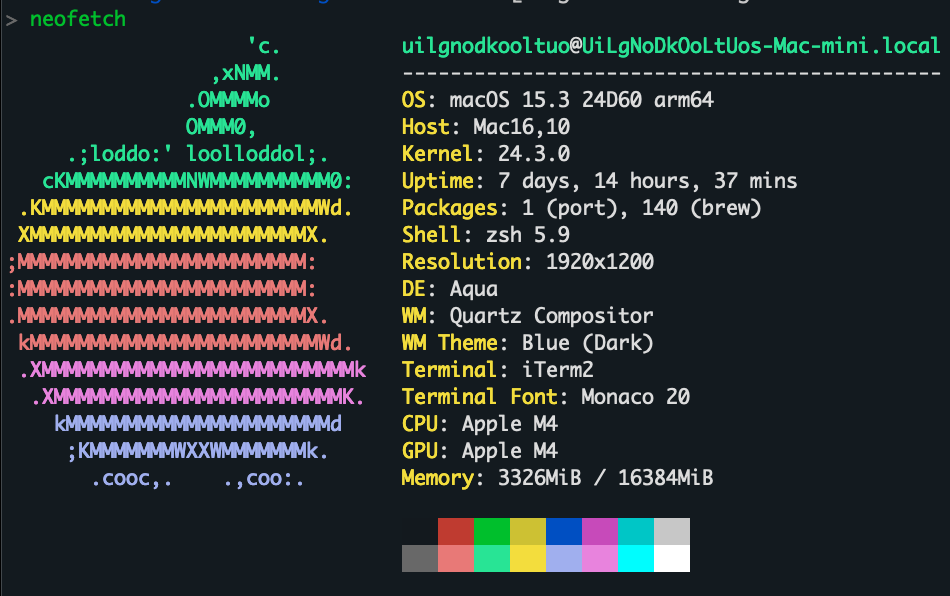

### 通过访问 edge://version/ 查看edge浏览器的版本，134.0.3120.0
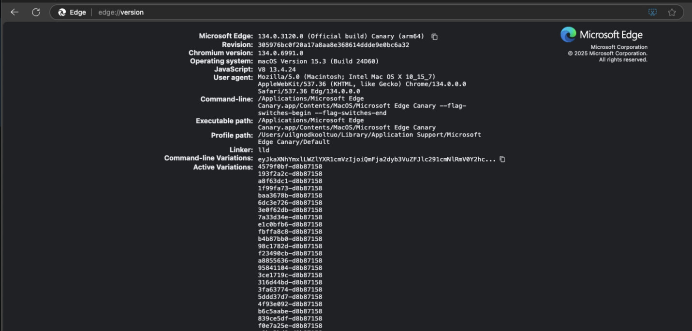

### 通过浏览器版本下载 [edge 浏览器的 webdriver 驱动](https://developer.microsoft.com/en-us/microsoft-edge/tools/webdriver/?form=MA13LH#downloads)
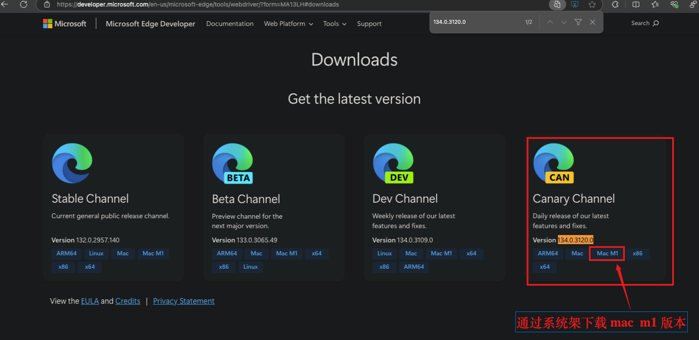

### 将其解压到指定目录，比如 `/Volumes/KingStonSSD1T/webdriver`
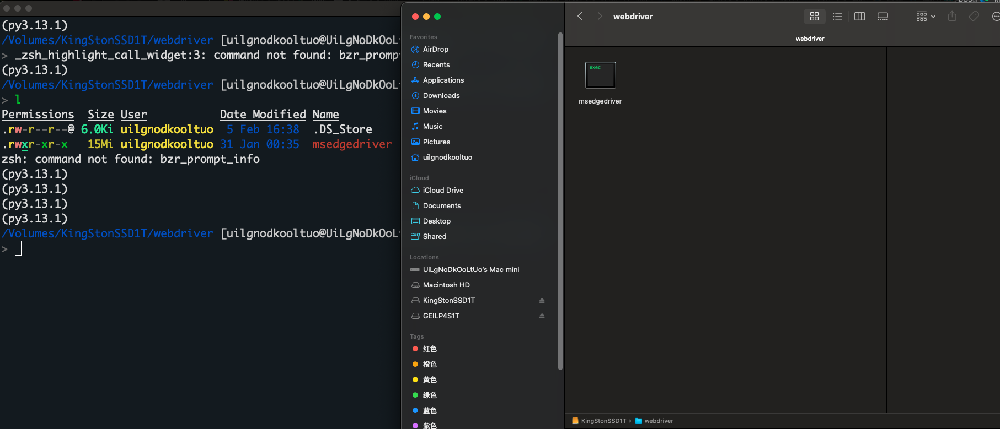

### 配置 zsh shell 环境变量
```shell
nano $HOME/.zshrc
```
> 在配置文件中最后一行，添加如下内容，其中 `WEBDRIVER_PATH=/Volumes/KingStonSSD1T/webdriver` 是我自定义的路径可以自行更改 
```plaintext
# 定义 msedgedriver 路径
WEBDRIVER_PATH=/Volumes/KingStonSSD1T/webdriver

# 判断 WebDriver 路径是否存在
if [ -d "$WEBDRIVER_PATH" ]; then
    # 导入 WebDriver 环境变量
    export WEBDRIVER_HOME="$WEBDRIVER_PATH"
    export PATH="$WEBDRIVER_HOME:$PATH"
    echo "WebDriver 路径存在，环境变量已导入。"
else
    echo "WebDriver 路径不存在。"
f
```
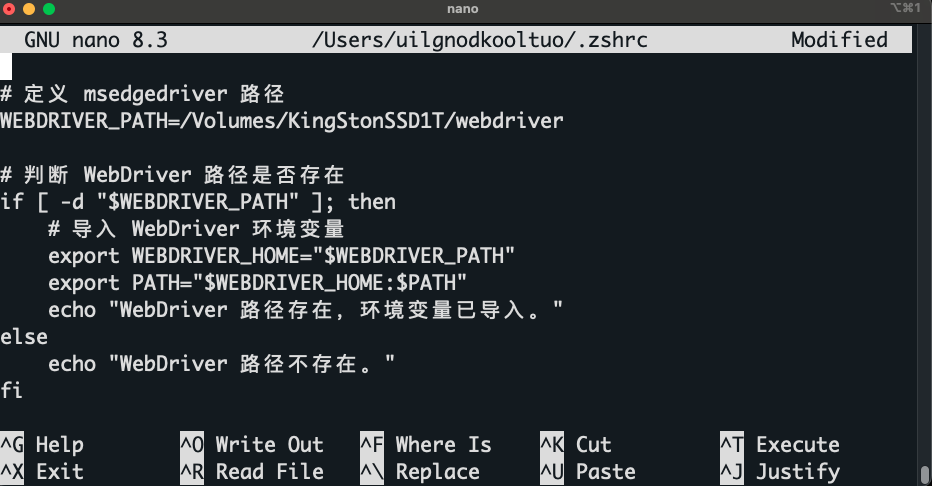
>
> 为 zsh shell 更新环境变量
```shell
source $HOME/.zshrc
```

### 测试 WebDriver 驱动
```shell
msedgedriver --version
```

###  使用 boss 直聘批量自动沟通脚本
#### 更新 pip 包管理工具，安装第三方库
```shell
# 更新 pip 工具
python -m pip install --upgrade pip
# 安装依赖包
pip install requests pandas selenium lxml
```
#### 下载[py脚本](https://github.com/20241204/BossMatchJobHunter/blob/master/Boss%E6%89%B9%E9%87%8F%E6%8A%95%E9%80%92%E8%84%9A%E6%9C%AC.py)，存储为.py文件比如 `zhipin.py`，完整代码如下：

#### 新增获取HR头像，名字，等级，并允许用户发送自定义消息，这样提升代码灵活度，也增加了冗余度(对不起，我能力真的很差，有新需求直接就堆代码，这是不好的习惯)
> 部分新增代码如下
```python
# 沟通界面，获取发送的信息元素
head_img='/html/body/div[11]/div[2]/div[1]/h3/div/img'
max_text1_element='/html/body/div[11]/div[2]/div[1]/h3/div/div/div[1]'
max_text2_element='/html/body/div[11]/div[2]/div[1]/h3/div/div/div[2]'
# 输入框元素
input_textarea = '/html/body/div[11]/div[2]/div[2]/div/div[1]/div[2]/textarea'
# 自定义发送消息内容
custom_info='目前我人在黑龙江，如果当地消费租房不高，有到外省工作的意愿！'
# 发送按钮元素
send_button = '/html/body/div[11]/div[2]/div[2]/div/div[1]/div[2]/div'
# 下一页按钮元素
button_next='//*[@id="wrap"]/div[2]/div[2]/div/div[1]/div[1]/div/div/div/a[last()]'

# 解析数据
def parser_page():
    try:
        html = etree.HTML(bro.page_source)
        # 检查有没有立即沟通按钮元素，有就点击，没有跳过
        if NodeExists(f'{chat_text}'):
            button_str = html.xpath(f'{chat_text}/text()')[0].strip().replace(" ", "")
            if button_str == '立即沟通':
                print(button_str)
                div = bro.find_elements(by=By.XPATH, value=chat_text)[0]
                bro.execute_script("arguments[0].click();", div)
                time.sleep(2)  # 增加等待时间，确保弹窗加载完毕

                # 处理头像、名字、等级
                try:
                    # 头像
                    if NodeExists(f'{head_img}'):
                        img_element = bro.find_element(by=By.XPATH, value=head_img)
                        img_src = img_element.get_attribute('src')
                        print(f'HR头像的src属性值: {img_src}')
                    else:
                        print('-'*15+'没获取到HR头像链接，继续'+'-'*15)
                    
                    # 名字
                    if NodeExists(f'{max_text1_element}'):
                        name_element = bro.find_element(by=By.XPATH, value=max_text1_element)
                        hr_name = name_element.text.strip().replace(" ", "")
                        print(f'HR名字: {hr_name}')
                    else:
                        print('-'*15+'没获取到HR名字，继续'+'-'*15)
                    
                    # 级别
                    if NodeExists(f'{max_text2_element}'):
                        name_element = bro.find_element(by=By.XPATH, value=max_text2_element)
                        hr_name = name_element.text.strip().replace(" ", "")
                        print(f'HR级别: {hr_name}')
                    else:
                        print('-'*15+'没获取到HR名字，继续'+'-'*15)
                except Exception as e:
                    print(f'处理头像、名字、等级时出错: {str(e)}')

                # 输入自定义内容并发送
                try:
                    # 输入自定义沟通内容
                    if NodeExists(f'{input_textarea}'):
                        text_area = bro.find_elements(by=By.XPATH, value=input_textarea)[0]
                        bro.execute_script("arguments[0].click();", text_area)
                        text_area.send_keys(f'{custom_info}')
                    else:
                        print('-'*15+'没获取到输入框元素，无法输入自定义内容，继续'+'-'*15)
                    
                    # 点击发送按钮
                    if NodeExists(f'{send_button}'):
                        send_btn = bro.find_elements(by=By.XPATH, value=send_button)[0]
                        bro.execute_script("arguments[0].click();", send_btn)
                    else:
                        print('-'*15+'没获取到发送按钮元素，无法点击发送自定义内容，继续'+'-'*15)
                except Exception as e:
                    print(f'处理输入自定义内容并发送时出错: {str(e)}')

            else:
                print(button_str)
        else:
            print('oops!没有发现沟通按钮')
    except Exception as e:
        print(f'oops!页面解析失败, 错误信息: {str(e)}')

# 判断节点是否存在捕获异常
def NodeExists(xpath):
    try:
        bro.find_element(by=By.XPATH, value=xpath)
        return True
    except Exception as e:
        print(f'元素 {xpath} 不存在，错误信息: {str(e)}')
        return False
```
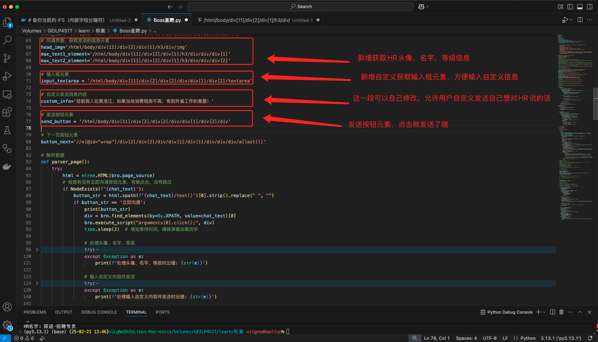
> 你可以找到并自定义修改 `custom_info` 发送内容变量，来说出想对hr说出的心里话
```python
# 自定义发送消息内容
custom_info='目前我人在黑龙江，如果当地消费租房不高，有到外省工作的意愿！'
```
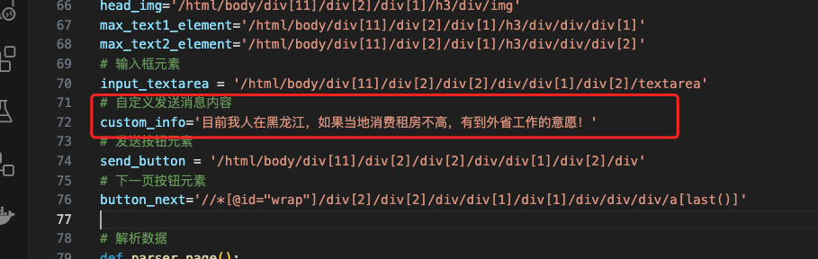

#### 新增允许用户手动指定浏览器路径
> 可以按照需要解除部分代码注释，你可以找到并自定义修改 `browser_path` 浏览器路径变量实现，部分代码如下
```python
    # 下载指定版本浏览器并执行
    # bro = webdriver.Edge()

    # 使用已安装的Edge浏览器
    options = webdriver.EdgeOptions()
    options.use_chromium = True
    # 确保浏览器路径正确
    browser_path = "/Applications/Microsoft Edge Canary.app/Contents/MacOS/Microsoft Edge Canary"
    options.binary_location = browser_path
    bro = webdriver.Edge(options=options)
```
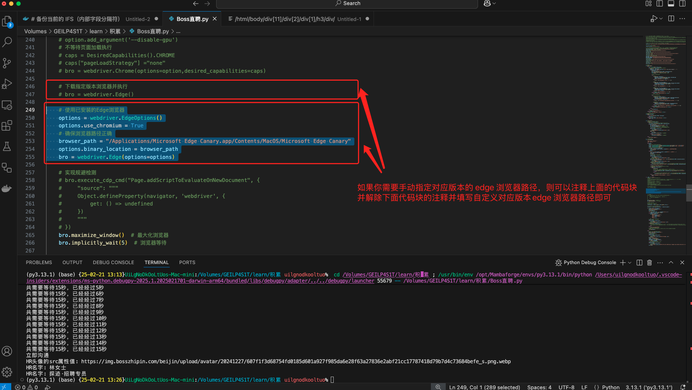
>
> 你也可以不做任何修改，可以按照需要解除部分代码注释实现，部分代码如下
```python
    # 下载指定版本浏览器并执行
    bro = webdriver.Edge()

    # 使用已安装的Edge浏览器
    #options = webdriver.EdgeOptions()
    #options.use_chromium = True
    # 确保浏览器路径正确
    #browser_path = "/Applications/Microsoft Edge Canary.app/Contents/MacOS/Microsoft Edge Canary"
    #options.binary_location = browser_path
    #bro = webdriver.Edge(options=options)
```
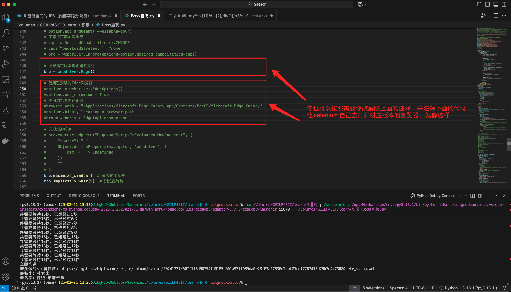


#### 修改脚本找工作的链接
> 打开浏览器，登陆boss直聘
> 搜索职位，并找自己喜欢的地区，岗位，类型，经验，薪资 并复制链接
>
> 比如 职位 `ai标注` `厦门` `职位类型->不限` `类型->全职` `工作经验->不限经验` `薪资->不限`
>
> 得到链接 `https://www.zhipin.com/web/geek/job?query=ai%E6%A0%87%E6%B3%A8&city=101230200&experience=101&jobType=1901`
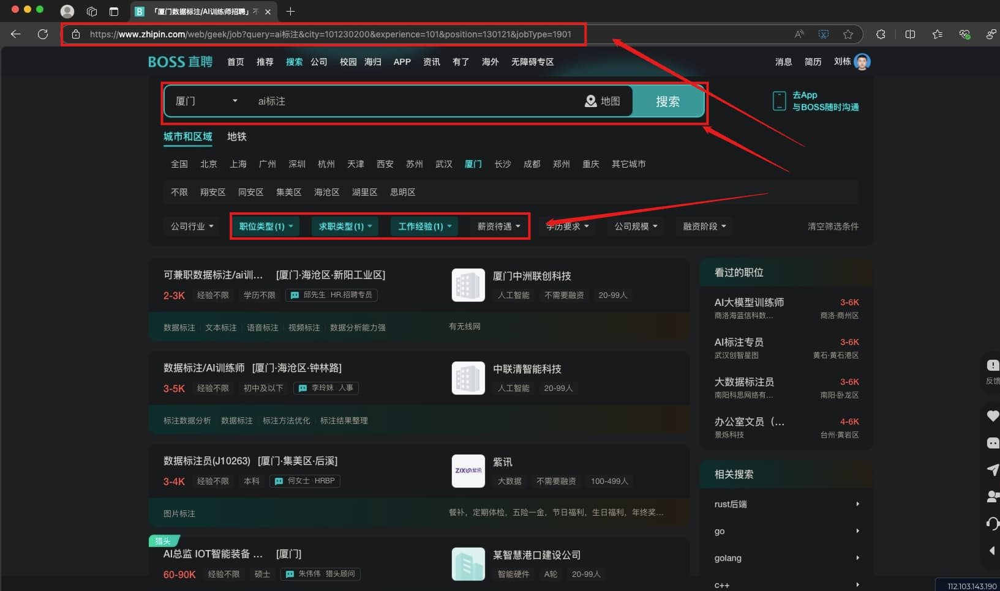
>
> 修改脚本中的链接参数 `search_url` 替换刚才得到的链接
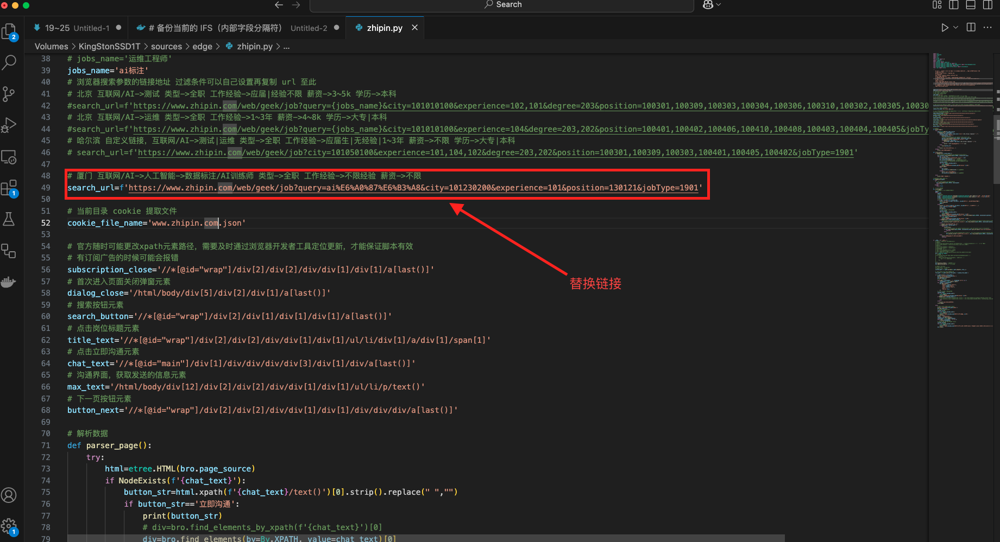

#### 执行脚本
```shell
python zhipin.py
```
> 执行脚本时 selenium 会下载对应版本的 edge 浏览器 app 到 `$HOME/.cache/selenium/MicrosoftEdge/mac-arm64/` 缓存路径
>
> `macOS` 有个特点，就是遇到新的app就会校验，校验不通过就会提示删除，并且终端也会报错，请点击 `cannel` 取消
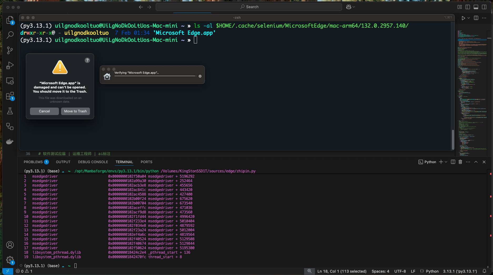
> 
> 此时点击 `System Settings` -> `Privacy & Security` -> `Security` 找到 新的 app 提示，点击始终打开 `Open Anyway`
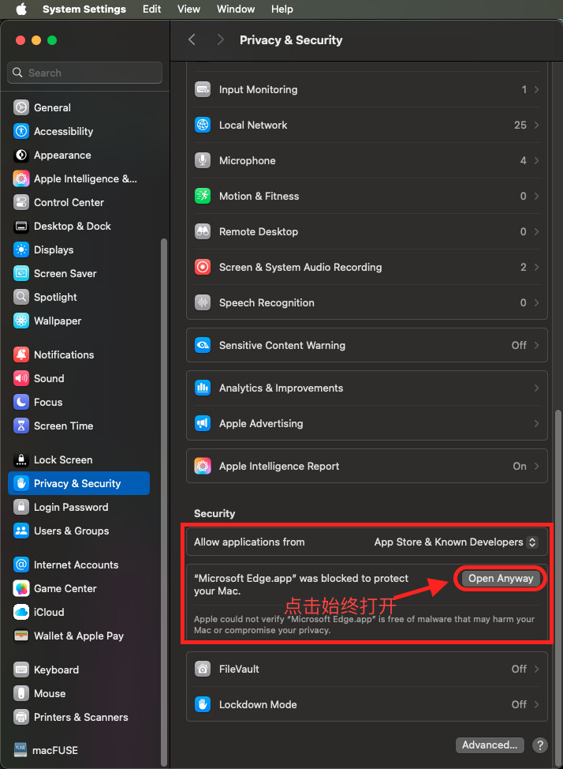
>
> 会弹出提示，是否打开，选择打开 `open`
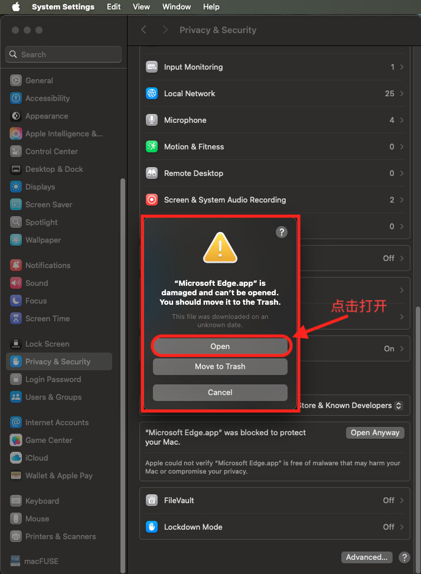
> 
> 会弹出密码框让用户再次确认，输入密码点击 `ok`
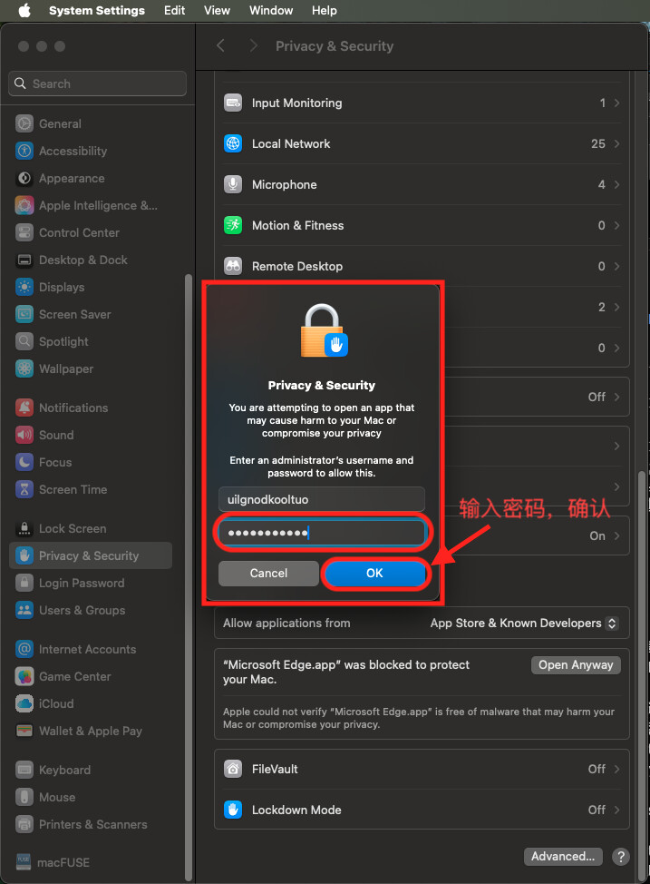
>
> 此时，会有一个全新的 edge 浏览器打开，连按两次快捷键 `command + Q` 退出即可 
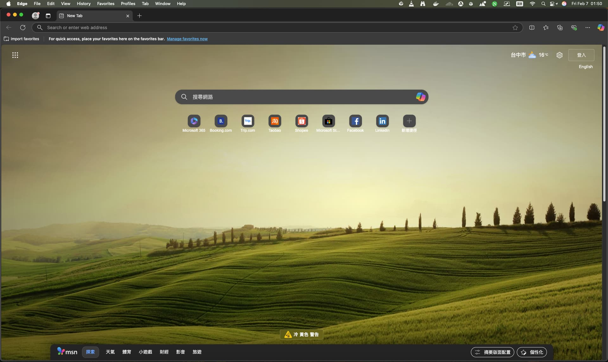
> 此时再执行脚本，应该就没问题了


#### 脚本运行说明
> 脚本第一次执行后，会给用户70秒时间登陆
>
> 然后70秒结束就会从登陆页面获取cookie存储为 `www.zhipin.com.json` 文件
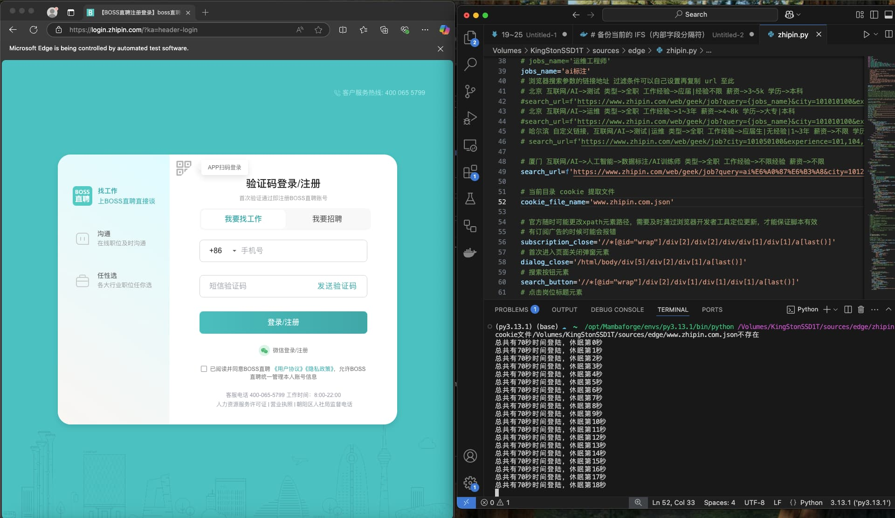
>
> 随后会给用户300秒的时间，下载安装 [J2TEAM Cookies插件](https://microsoftedge.microsoft.com/addons/detail/j2team-cookies/lmakhegealefmkbnagibiebebncemhgn?hl=en-US)
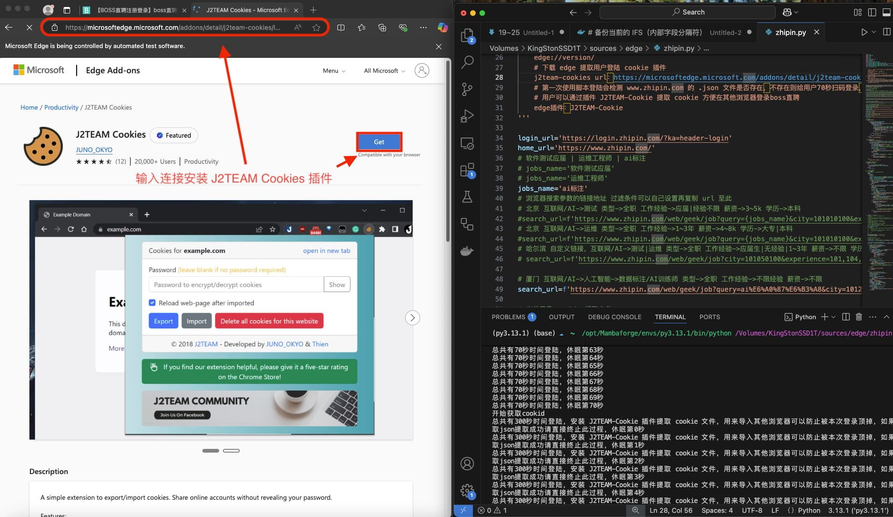
>
> 导出 cookie 保存为文件，这个文件可以随时通过 [J2TEAM Cookies插件](https://microsoftedge.microsoft.com/addons/detail/j2team-cookies/lmakhegealefmkbnagibiebebncemhgn?hl=en-US) 导入，这样在关闭脚本之后可以使用这个 cookie 文件将boss直聘登录信息恢复到已经被顶掉的正常浏览器中，就不用在反复扫码登录了，这段操作300秒够用了,300秒之后脚本会自动退出
>
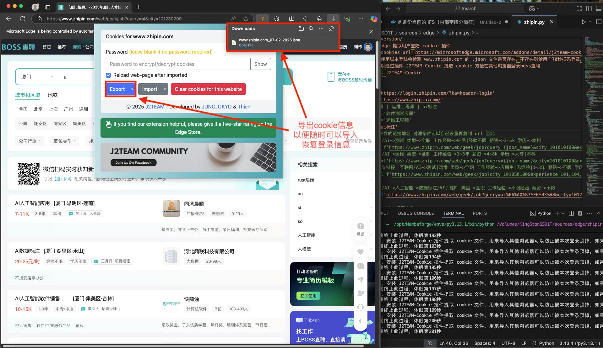
> 
> 再次执行脚本，脚本会检测自己保存的 `cookie` 文件 `www.zhipin.com.json` 是否存在，并加载登录信息，然后就可以自动化简历沟通了
> 我觉得，这样就满足了我对批量立即沟通的需求，只要能引起人事的反应就行
> 这个脚本肯定有更高的优化空间，不过目前就够用了
```shell
python zhipin.py
```
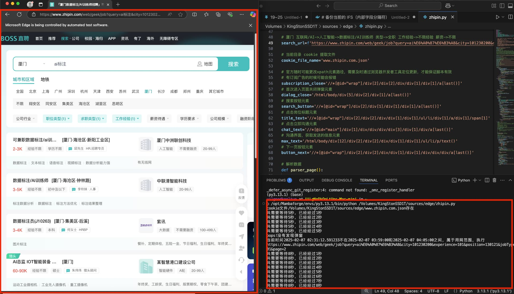
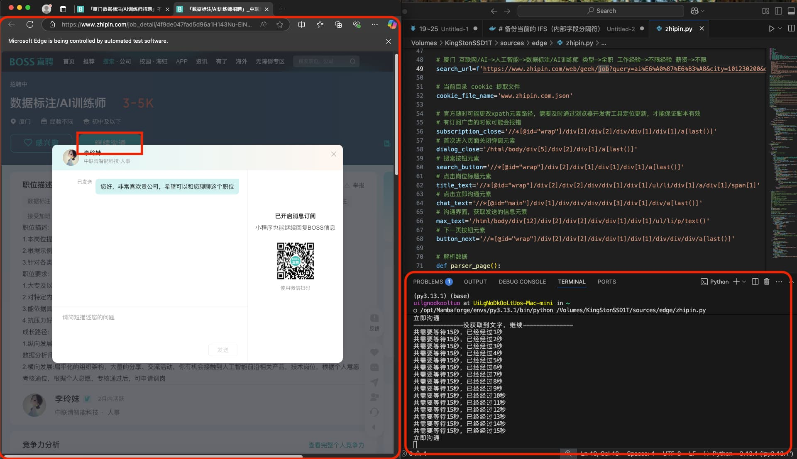

#### 最终幻想，效果
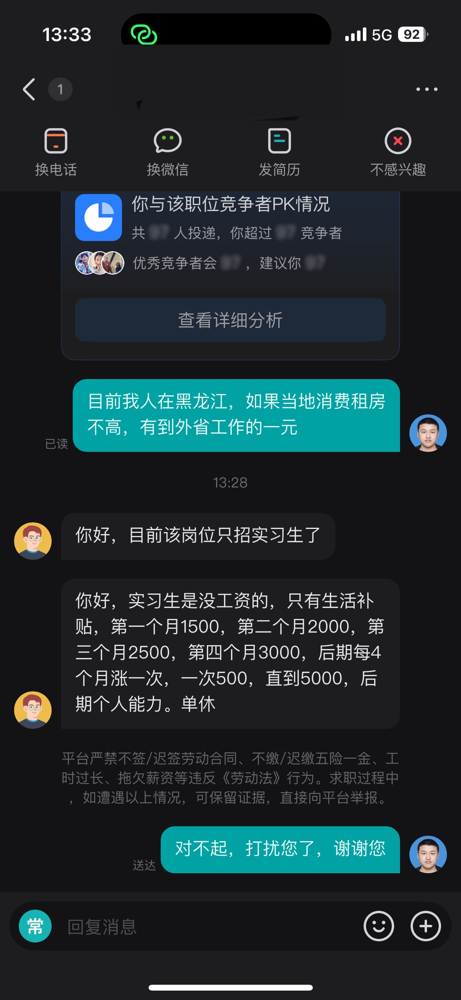

## 注意
  Edge webdriver 和 Edge 浏览器版本要统一，浏览器地址栏输入 edge://version/ 可以查看浏览器版本  
  
  执行脚本首先会给用户 70秒（这个可以自己修改时间）的时间登录并获取脚本所需的 cookie 文件   
  
  获取脚本 cookie 文件后会再给用户 300秒（这个可以自己修改时间），是为了让用户通过 Edge 浏览器安装 J2TEAM Cookies 插件，并提取浏览器可以使用的 cookie 提取浏览器通用 cookie 文件这样做的目的是为了让本机浏览器的 cookie 互通防止登录之后顶掉其他浏览器的登录状态，之后在其他浏览器访问 boss直聘 链接通过 J2TEAM Cookies 插件倒入浏览器通用 cookie 文件，就登录成功了  
  
  搜索链接 search_url 怎么配置，其实很简单，随便打开浏览器登录 Boss 直聘，搜索自己想要投递的职位并选择过滤条件，最后复制地址栏的地址粘贴到 Boss批量投递脚本.py 脚本的变量 search_url 中即可  

  xpath 路径官方随时会更改导致本脚本失效，你需要借助浏览器开发者工具对特定元素路径进行更新
  
## 风险(不良反应-_-)

  1、风险就是有可能会被BOSS直聘暂停访问PC端web页面，但是手机客户端不受影响，说明 B/S 框架产品和 C/S 框架产品调用的API互不影响  
  2、也许可以尝试自动化 C/S 框架产品投递简历，目前还没有思路，可能要学一些知识才能实现了，目前暂时没时间，等找到工作稳定下来再尝试  
  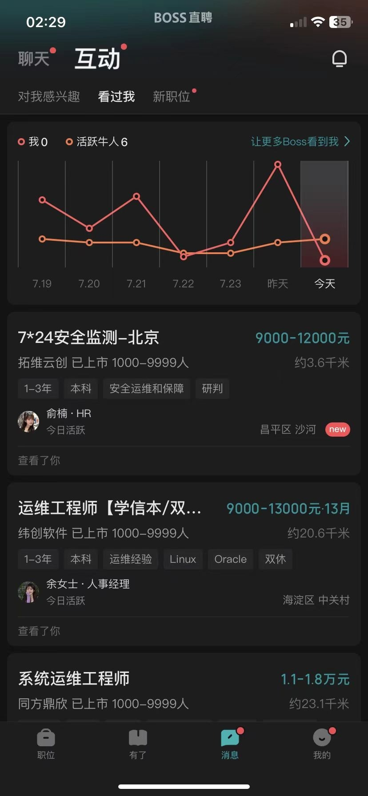
  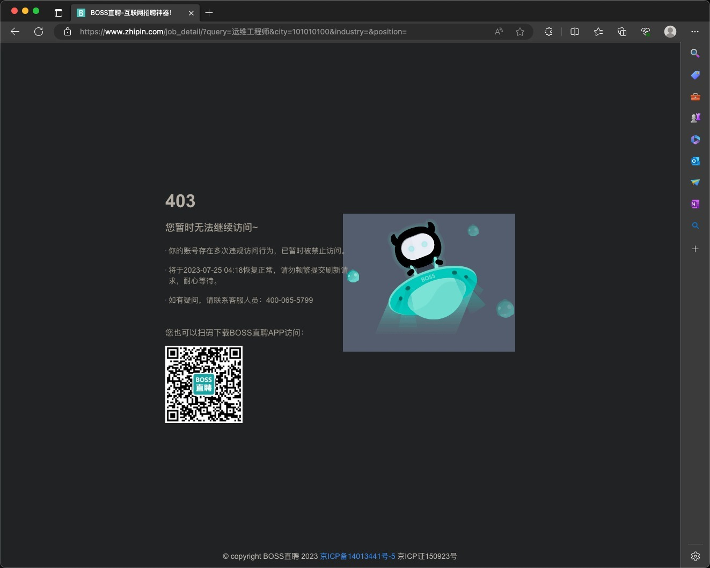

# 感谢
[协助者 linux.do 三级用户 AI 机器人](https://linux.do/)  

